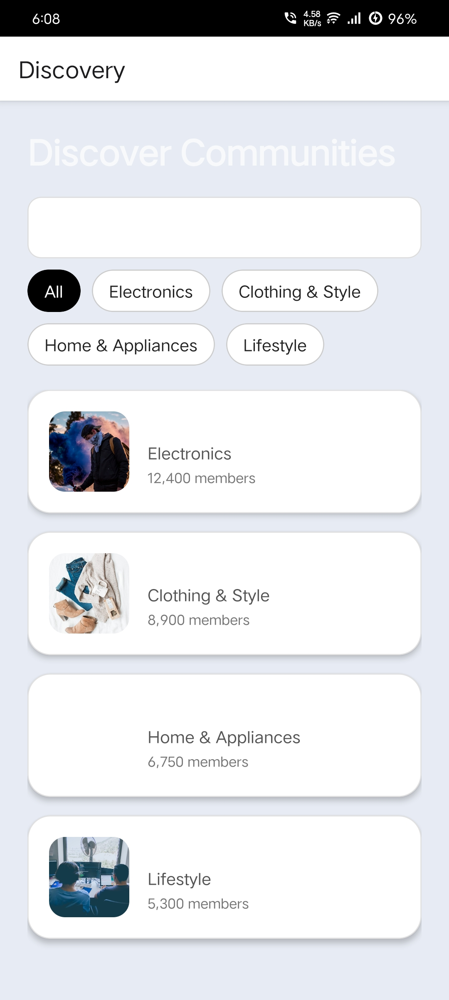
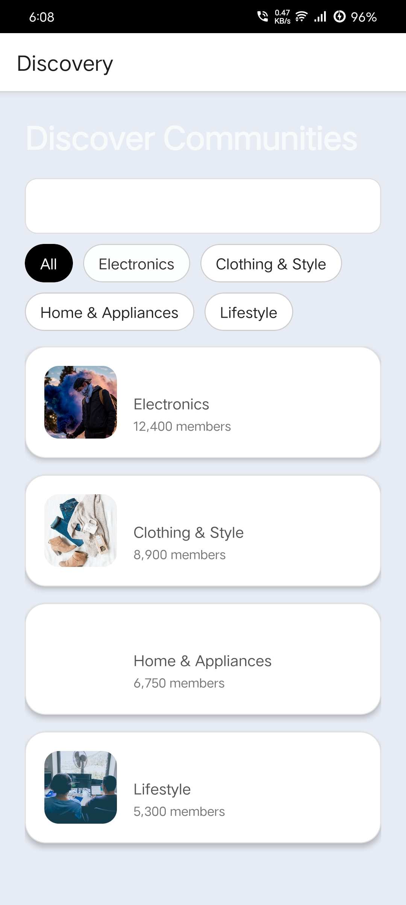
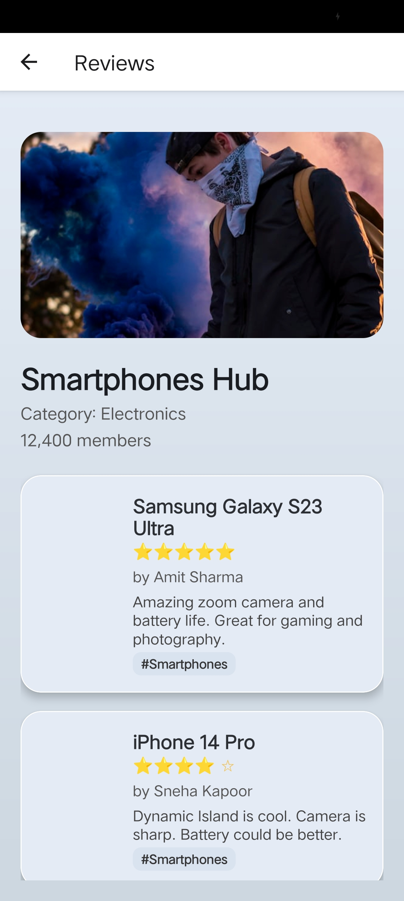
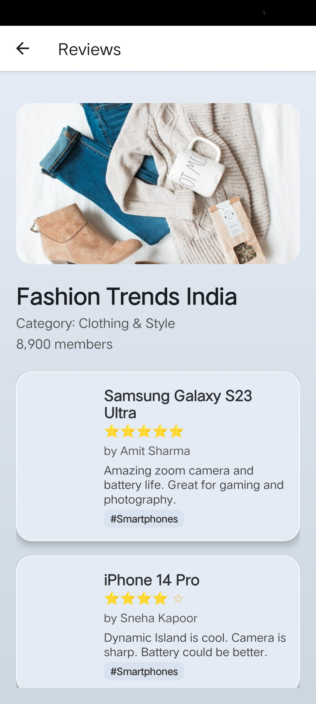
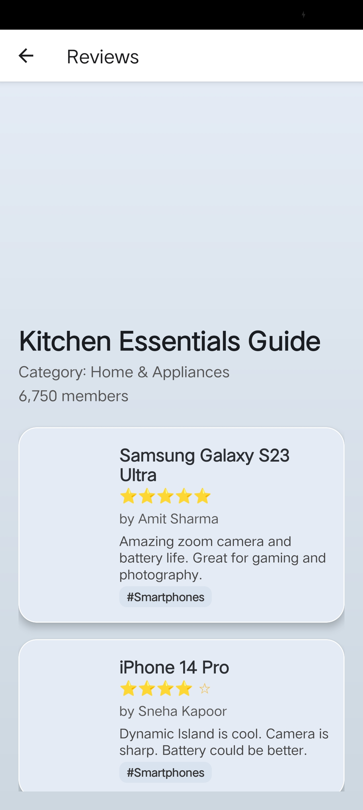
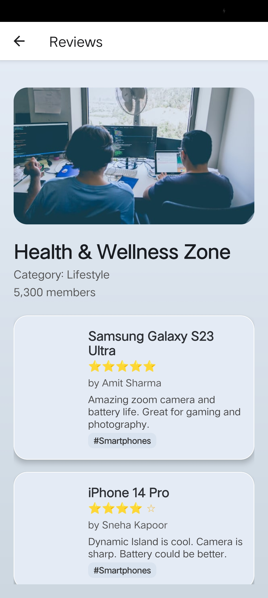
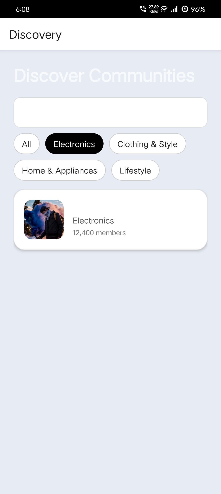
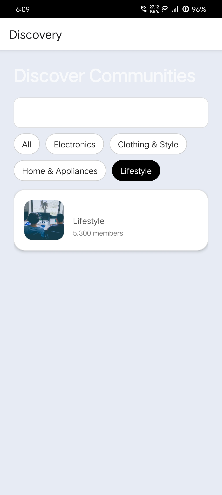
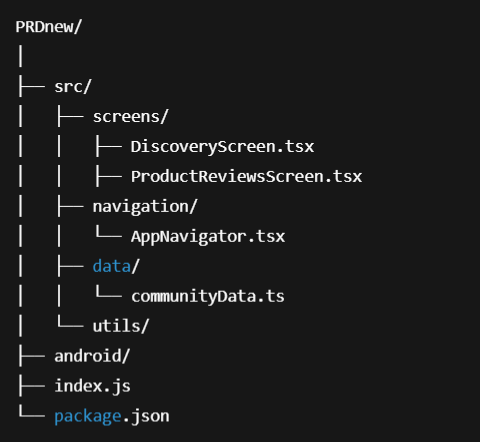

# 📱 ProductReviewDiscovery  
**A Community-Based Product Review Explorer (React Native Prototype)**

ProductReviewDiscovery is a mobile-first UX prototype that reimagines how people research products online. Instead of forcing users to scroll through endless scattered reviews, sponsored posts, and credibility confusion, this app introduces a **community-centric discovery flow**. Users explore interest hubs like *Electronics*, *Clothing & Lifestyle*, or *Home Appliances* — each acting as a contextual review environment rather than a chaotic mixed-feed of opinions.

This prototype validates a new direction in product research where reviews are structured, humanized, and cognitively comfortable rather than overwhelming. The goal is to make discovery **clear, trustworthy, and visually calming**.

---

## 🎯 **Why This Project Exists**

Traditional review systems create friction:

| Problem in Existing Platforms |       Impact on Users       |
|-------------------------------|-----------------------------|
| Walls of unstructured text    | Cognitive fatigue           |
| Sponsored/biased reviews      | Trust breakdown             |
| No context of expertise       | Poor decision confidence    |
| UI clutter + ads              | Drop-off / confusion        |

### 🚀 ProductReviewDiscovery Solves This By:
- 🧭 **Community Hubs** → Users start with interest-based zones, not a blank search bar
- 🏷 **Clustered Product Context** → Reviews stay within topic boundaries
- 🪶 **Neumorphic + Soft UI** → Low-stress visual environment
- 🔍 **Micro-Summaries** → Faster comprehension instead of 300-word review dumps
- 📊 **Perspective Prioritization** → Helps build decision confidence faster

This is not a marketplace or shopping app — **it is an experiment in review experience design** with research foundations in cognitive load theory, UI psychology, and trust-based UX systems.

---

## 🧠 **UX Research & Concept (Extended Overview — ~750 words)**

ProductReviewDiscovery challenges the conventional passive consumption model. On most platforms, users perform a search, drown in hundreds of opinions, mentally filter credibility, and exit more confused than when they started. This prototype’s hypothesis is simple:

> *“If we reduce cognitive load + improve context clarity → decision confidence increases.”*

### 🔎 Context Before Content
The app flips the traditional flow:

| Old Flow (Passive)  |         New Flow (Contextual)             |
|---------------------|-------------------------------------------|
| Search → chaos      | Select community → explore within context |
| Randomized content  | Topic-consistent insights                 |
| Blind credibility   | Pattern-based familiarity                 |
| Mental overload     | Structured micro-insights                 |

The underlying value is not only UI polish — it is **intentional navigation**.

- Users are not exposed to irrelevant information
- Reviews feel organized by *shared mental models*
- Category → Product → Perspective becomes a guided path

This design aligns with theories of **Human-Centric Information Architecture**, particularly in:

- Cognitive Load Optimization
- Progressive Disclosure
- Contextual Priming
- Information Scenting

### 🎨 Visual & Interaction Psychology
The UI uses **Neumorphism**, a soft UX design language with subtle shadows and depth. This creates a tactile environment that:

- Removes harshness from typical card grids
- Makes interaction points feel approachable
- Reduces "visual shout" and improves scanning

Combined with generous whitespace and low-contrast surfaces, the interface acts as a **calming buffer** between the user and overwhelming information.

### 🧩 Where This Research Can Go Next
If scaled, this concept can evolve into a full ecosystem:

| Phase       | Feature                     | Purpose                          |
|-------------|-----------------------------|----------------------------------|
| 🚧 Phase 2  | User Profiles               | Build trust & reputation mapping |
| 🧠 Phase 3  | AI Review Summaries         | Instant credibility scanning     |
| 🗳️ Phase 4 | Voting / Credibility Scores  | Crowd-evaluated trust            |
| ☁️ Phase 5 | Firebase / Backend           | Real data ingestion              |

This prototype proves that a **human-friendly review system is possible**, and that clarity can be engineered.

---

## ✨ **Feature Highlights**
- 🧭 **Community-Centric Navigation**
- 🪶 **Soft UI / Neumorphic Interaction System**
- 🎞️ **Smooth Category → Product → Review Flow**
- 🧱 **Stable build (Hermes + Reanimated fixed)**
- 📱 **Optimized for Android**

---

## 📸 **Screenshots (Mobile Demo Preview — 3×3 Grid)**

> *(Images are mobile dimensions; displayed in structured grid for clarity)*

|                          |                          |                          |
|--------------------------|--------------------------|--------------------------|
|  |  |  |
|  |  |  |
|  |  |  |

---

## 🎥 **DEMO VIDEO**
🚀 Experience the walkthrough of ProductReviewDiscovery in action:

👉 **[CLICK HERE TO WATCH THE DEMO VIDEO](https://drive.google.com/file/d/16R0WrJoQ1dlbdTMIaNi6PirD9bkLFJ62/view?usp=drive_link)**


---

## 🗂 **Project Directory Structure**
📌 *Visual structure generated from project*

<p align="center">
  
</p>

---

## 🛠 **Core Tech Stack**
|      Area     |               Tool              |
|---------------|---------------------------------|
| Framework     | React Native CLI                |
| Language      | TypeScript                      |
| Navigation    | @react-navigation/native-stack  |
| State Mgmt    | React Hooks                     |
| UI            | Neumorphism / Soft UI           |
| Platform      | Android (SDK 34)                |

---

## 📦 **Installation & Running the App**

### 📍 Requirements
- Node.js LTS
- Java JDK 17
- Android Studio (SDK Platform 34)
- A physical device or emulator

### ▶️ Setup
```sh
npm install
▶️ Start Metro
sh
Copy code
npx react-native start --reset-cache --port 9092
▶️ Run App (Android)
sh
Copy code
npx react-native run-android --port 9092
⚠️ If Build Issues Happen
sh
Copy code
cd android
gradlew clean
cd ..
📱 Build APK (Debug)
sh
Copy code
cd android
gradlew assembleDebug
APK Output:

swift
Copy code
android/app/build/outputs/apk/debug/app-debug.apk
🧭 Roadmap
Feature	Status
Firebase Integration	⏳ Planned
User Profiles & Accounts	📌 In Design
AI Review Summarization	💡 Prototype phase
Credibility Scoring System	🎯 Planned
Play Store Publish	🤝 Future milestone

🧩 Conclusion
ProductReviewDiscovery demonstrates that review systems don’t need to be chaotic. By applying cognitive-friendly design, community scaffolding, and visual calmness, research becomes pleasant instead of exhausting. This prototype achieves:

✔ Stable navigation
✔ Validated UX direction
✔ Technical build ready for expansion

Next steps will transform the prototype from concept → living review network.

